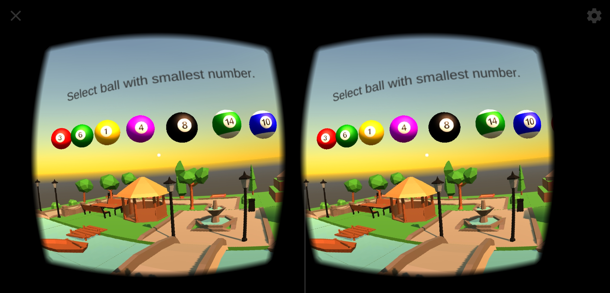
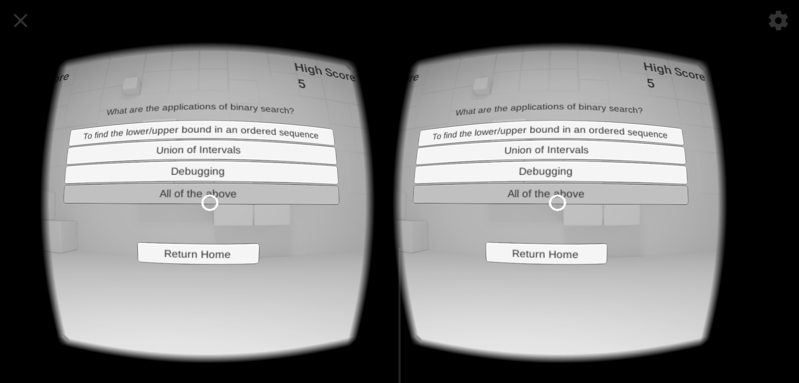
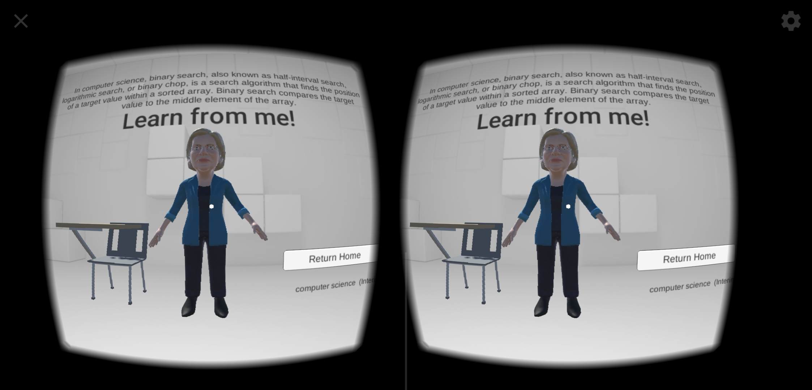

# VRCoders

An android application based on Virtual reality to teach students programming concepts in an immersive environment.

## Installation

1. Install f1.apk in your android device
2. Go to App settings -> Manage Permissions -> Give access to Microphone and Storage
3. Turn on your internet
4. Launch the application, plug your device into a VR cardboard headset
5. Happy Learning!

## Snapshots

## License
[MIT](https://choosealicense.com/licenses/mit/)
